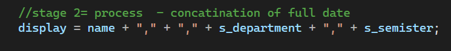
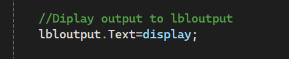

# Week 1 - C# Windows Forms Practice

## 1. Creating Variables

In this step, variables are declared to store the user's information:

- `name` stores the student name.
- `s_department` stores the department.
- `s_semister` stores the semester.
- `display` stores the final concatenated text.
- `s_id` stores the student ID as an integer.

The following screenshot shows how the variables are declared in C#.

---

## 2. Initial Values to Variables

In this step, the values from the text boxes are assigned to the respective variables.

The following screenshot shows how the text box inputs are assigned.

---

## 3. Convert String to Integer

In this step, the student ID text input is converted into an integer format using the parse method.

The following screenshot shows the string to integer conversion.

---

## 4. Concatenating the Information

In this step, the variables and comma separators are combined using the `+` operator.

The following screenshot shows the string concatenation process.

---

## 5. Displaying the Output

After processing, the combined text value is assigned to the Label control.

The following screenshot shows how the output is displayed.

